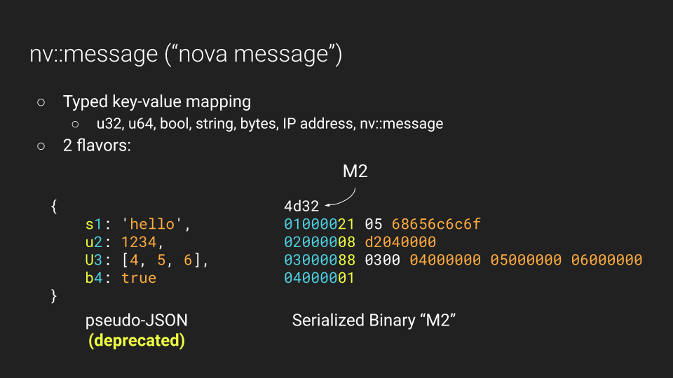
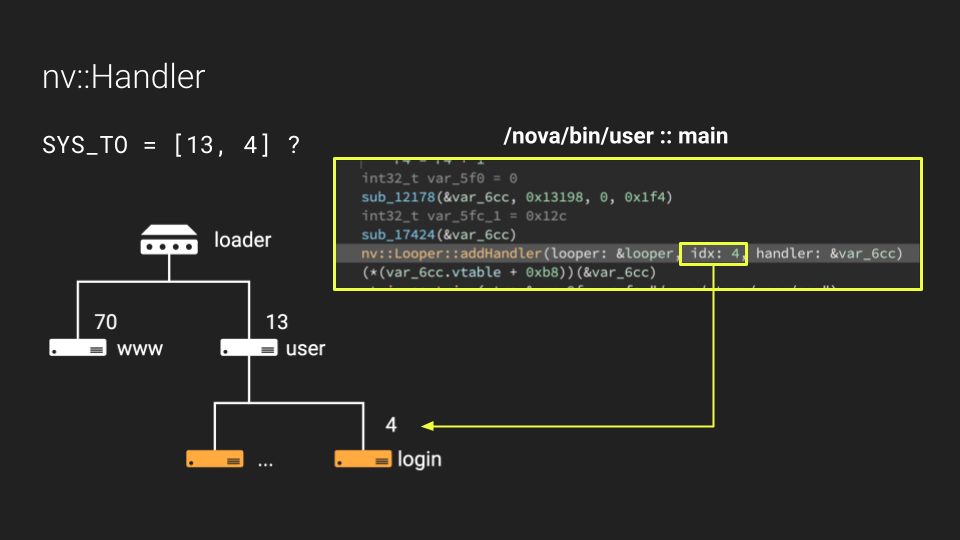
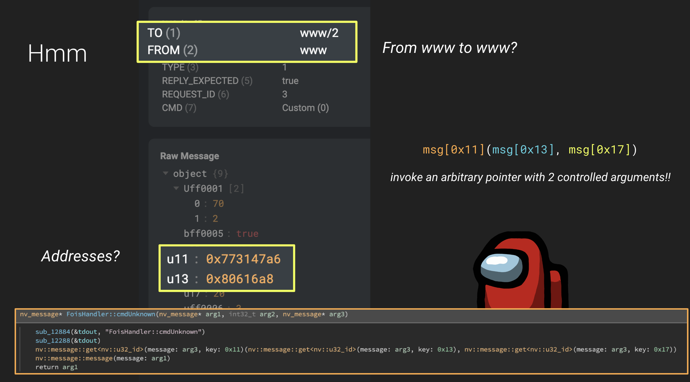
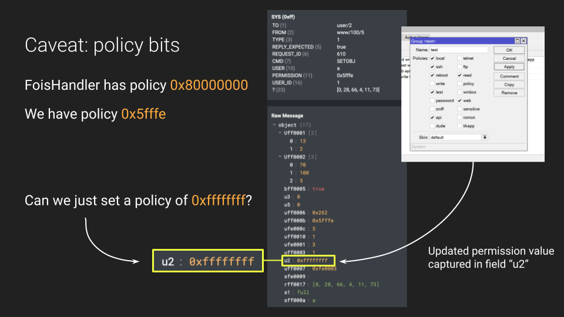

```
  ______ ____ _____  _____ _           _ 
 |  ____/ __ \_   _|/ ____| |         | |
 | |__ | |  | || | | (___ | |_ ___  __| |
 |  __|| |  | || |  \___ \| __/ _ \/ _` |
 | |   | |__| || |_ ____) | ||  __/ (_| |
 |_|    \____/_____|_____/ \__\___|\__,_|
```

# FOISted: a MikroTik remote jailbreak

# Description 

FOISted is an exploit for two post-authentication vulnerabilities in MikroTik's RouterOS. It can be used to remotely jailbreak RouterOS running 6.34 (2016) to 6.49.6 (latest v6 release).

This repository includes an exploit script for devices running x86. The vulnerability exists on other device versions as well; writing the ropchain is left as an exercise to the reader :)

For some more info, check out our blog post on RouterOS internals: https://margin.re/blog/pulling-mikrotik-into-the-limelight.aspx

# Usage

**Automagic:**
```console
$ python3 exploit.py -H <router_ip> -u <username> -p <password>
```

Then later:
```console
$ nc <router_ip> 1337
```

The exploit script will determine the RouterOS version and deploy the correct ropchain automatically. Note: currently only x86 RouterOS is supported.

If your version is not identified for some reason, you can pass it explicitly with:
```sh
-v <version> # e.g. 6.49.6
```

If you are running this on newer RouterOS versions than 6.49.6 (latest at the time of public release), your RouterOS version might not be in the gadget database (`./db`). You can instead pass the path to `/nova/bin/www` and the exploit script will automatically try to find the right gadgets for the ropchain:

```sh
-f /path/to/nova/bin/www
```

# How does it work?

FOISted leverages two vulnerabilities in RouterOS v6 to enable remote code execution. In this section we go over some background knowledge about RouterOS IPC and discuss the two vulnerabilities.

Note: this section is mostly an abbreviated version of our [full blog post](https://margin.re/blog/pulling-mikrotik-into-the-limelight.aspx). Definitely check that out for more details!

## RouterOS IPC

Inside MikroTik's RouterOS, programs communicate with eachother using a custom IPC protocol.

The actual data packets are Nova Messages (`nv::message` internally). These exist in a pseudo-JSON format (pre 6.38) and a serialized binary format:



Each process has a fixed address inside the RouterOS system; for example `/nova/bin/user` is at address `13` and `/nova/bin/www` is at address `70`. Additionally, each program can register handlers which implement some specific functionality in a sub-namespace. For example, `/nova/bin/user` has a handler at address `4` that acts as the "login" endpoint and performs authentication for other services:



IPC communication is a crucial part of RouterOS operation. It is used to:
- perform authentication
- update/retrieve configuration parameters
- send frequent updates about process state (e.g. network stats)
- enforce user access management
- notify processes when a client has disconnects
- ... and many more

During our reverse engineering efforts, we wrote an internal message tracer tool that allows us to visualize all of the messages exchanged during operation of the router.

In the following demo, you can see all of the messages exchanged as we paginate through the web interface: https://youtu.be/Em1hVWnbzQ4

[](https://youtu.be/Em1hVWnbzQ4)

## Bug 1: FoisHandler

The RouterOS web interface is implemented by the `/nova/bin/www` binary. However, specific pages might get handled by separate "Servlet" libraries which implement functionality in separate shared libraries.

For example, the `jsproxy.p` servlet handles requests to `/jsproxy` and the `winbox.p` servlet handles requests to `/winbox`, etc...

These servlets are libraries that get loaded into `/nova/bin/www` the _first_ time that they are needed. For example, the first time we load `/jsproxy`, the `jsproxy.p` library will get loaded into the memory space.

During this library loading process, we noticed some interesting traffic in the message tracer:



Specifically, we found a message that was being sent _from_ the www binary to handler #2 of www. This is already suspicious because RouterOS IPC is intended for _**inter**-process communication_ not communication inside the same process...

Additionally, we noticed that two of the arguments seemed to be virtual pointers (32-bit x86) which piqued our interest because it was very unusual.

Inspecting the actual functions inside handler #2 of `/nova/bin/www`, we find a function called `FoisHandler::cmdUnknown` that gets run when these types of messages are received.

Amazingly, this function pulls out parameter `0x11` from the message and _invokes it as a function_ using two of the other parameters as arguments!

So clearly, if we can send a controlled message that hits this handler, we can invoke any function we want. And from there, it is fairly easy to pivot into a ropchain and do something more sophisticated.

## Sending IPC Messages

There are several ways to send internal IPC messages as a user of RouterOS. In fact all of the external clients allow you to send arbitrary messages after you have authenticated:
- Winbox (accessed on `8291`) -- used by the `winbox.exe` client
- MAC Telnet -- used to connect when router has no ip address
- WebFig -- used by the front-end web interface

These interfaces vary in the way they perform the initial authentication handshake but once authenticated, enable a user to proxy arbitrary Nova Messages into the internal system. See our [blog post](https://margin.re/blog/mikrotik-authentication-revealed.aspx) and [repository](https://github.com/MarginResearch/mikrotik_authentication) for reverse-engineering the Winbox and MAC Telnet cryptographic protocols!

In this exploit implementation, we use the WebFig endpoint as our primary mechanism for communication. See `webfig.py` for our reverse-engineered client implementation.

However, there is a problem when we try to invoke our vulnerable `FoisHandler` endpoint: 

Every handler in RouterOS can define a "policy" bitmask that specifies which users are allowed to invoke it. It turns out that `FoisHandler` has a policy of `0x80000000` which indicates only internal access (i.e. messages originating from other system processes).

As an admin user, the max permission bitmask we can set with the GUI is only `0x7fffe` which is not sufficient.

## Bug 2: Privilege Escalation

This brings us to our second bug: a privilege escalation from admin to "super-admin."

While the GUI only lets us set a permission bitmask of `0x7fffe`, internally it is actually just sending an IPC message with one of the fields containing the bitmask value:



So we can just forge our own message with the permission bitmask value set to `0xffffffff`!

Once we do this, we now have unrestricted access to hit any endpoint in the system!

## Exploit Implmentation

Our exploit starts by uploading two files to the system over FTP:
- `stage2`: containing a reverse shell spawner listening on port 1337
- `busybox`: providing us with a proper shell environment

Our exploit then performs privilege escalation to enable us to hit the `FoisHandler` endpoint.

Finally we send a crafted message to pivot to a ropchain embedded in the message. The ropchain calculates the address of `chmod` and `execve` in `uClibc` and performs:
- `chmod 0777 stage2`
- `execve stage2`

Once `stage2` is running, you can connect to port 1337 and get a shell!

# FAQ

## Can people use this to hack my router?

No, both of these vulnerabilities require admin credentials to exploit.

## What versions does it work on?

The vulnerabilities exist from at least 6.27 (the earliest software we could download) to the most recent v6: 6.49.6. The web interface was refactored in RouterOS v7 and the vulnerable handler was removed entirely. Our POC is written for x86.

The exploit script works (tested!) against every RouterOS version from 6.34 to 6.49.6.
